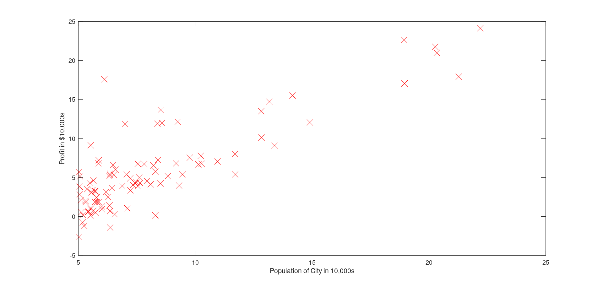
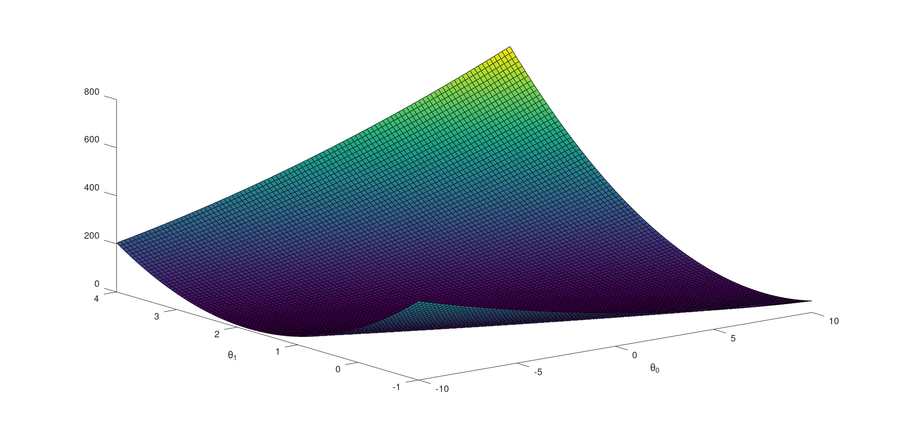
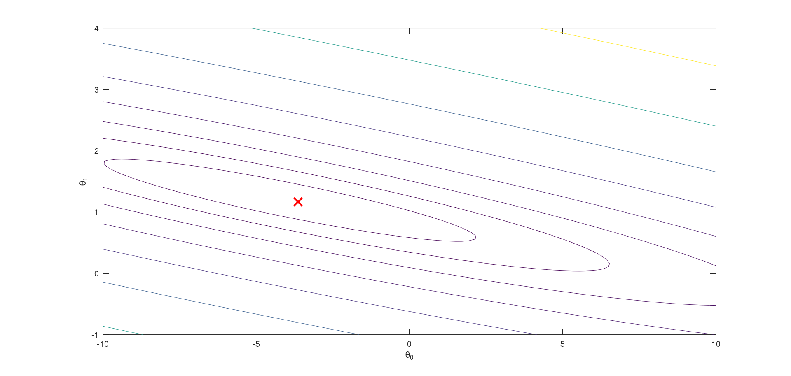
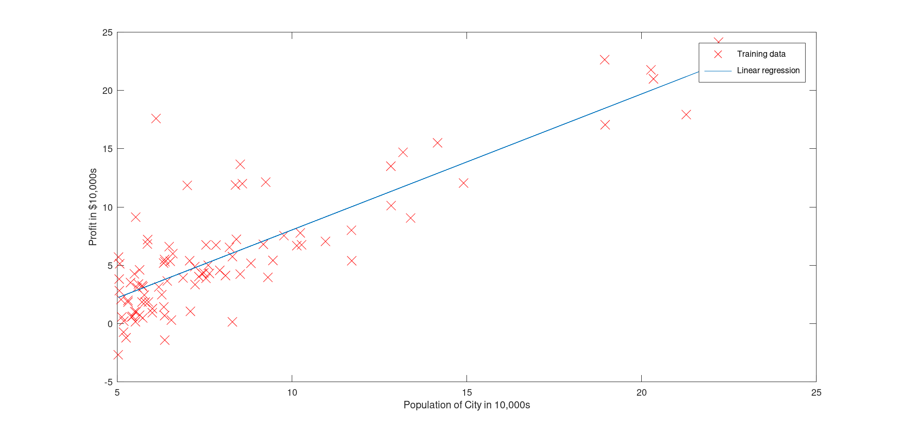

# Programming Assignment: Linear Regression

## ex1

Diagonal Matrix

   1   0   0   0   0
   0   1   0   0   0
   0   0   1   0   0
   0   0   0   1   0
   0   0   0   0   1

Program paused. Press enter to continue.
Plotting Data ...

Program paused. Press enter to continue.

Testing the cost function ...
With theta = [0 ; 0]
Cost computed = 32.072734
Expected cost value (approx) 32.07

With theta = [-1 ; 2]
Cost computed = 54.242455
Expected cost value (approx) 54.24
Program paused. Press enter to continue.

Running Gradient Descent ...
Theta found by gradient descent:
-3.630291
1.166362
Expected theta values (approx)
 -3.6303
  1.1664

For population = 35,000, we predict a profit of 4519.767868
For population = 70,000, we predict a profit of 45342.450129
Program paused. Press enter to continue.

Visualizing J(theta_0, theta_1) ...

## ex1_mulit 

 Loading data ...
First 10 examples from the dataset:
 x = [2104 3], y = 399900
 x = [1600 3], y = 329900
 x = [2400 3], y = 369000
 x = [1416 2], y = 232000
 x = [3000 4], y = 539900
 x = [1985 4], y = 299900
 x = [1534 3], y = 314900
 x = [1427 3], y = 198999
 x = [1380 3], y = 212000
 x = [1494 3], y = 242500
Program paused. Press enter to continue.
Normalizing Features ...
Running gradient descent ...

Theta computed from gradient descent:
 334302.063993
 100087.116006
 3673.548451

Predicted price of a 1650 sq-ft, 3 br house (using gradient descent):
 $289314.620338
Program paused. Press enter to continue.
Solving with normal equations...
Theta computed from the normal equations:
 89597.909543
 139.210674
 -8738.019112

Predicted price of a 1650 sq-ft, 3 br house (using normal equations):
 $293081.464335
