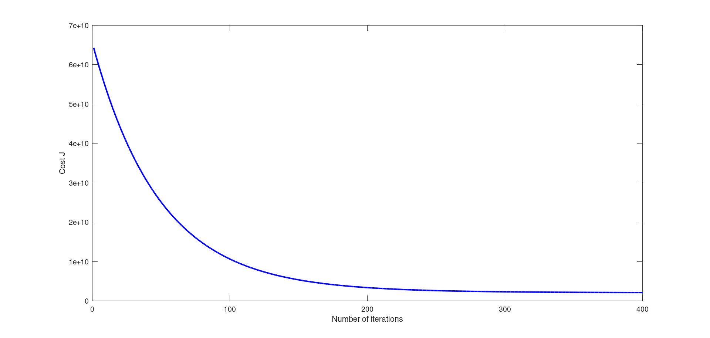

# Programming&nbspAssignment:&nbspLinear&nbspRegression

## ex1

Diagonal&nbspMatrix 

&nbsp&nbsp&nbsp1&nbsp&nbsp&nbsp0&nbsp&nbsp&nbsp0&nbsp&nbsp&nbsp0&nbsp&nbsp&nbsp0&nbsp 
&nbsp&nbsp&nbsp0&nbsp&nbsp&nbsp1&nbsp&nbsp&nbsp0&nbsp&nbsp&nbsp0&nbsp&nbsp&nbsp0 
&nbsp&nbsp&nbsp0&nbsp&nbsp&nbsp0&nbsp&nbsp&nbsp1&nbsp&nbsp&nbsp0&nbsp&nbsp&nbsp0 
&nbsp&nbsp&nbsp0&nbsp&nbsp&nbsp0&nbsp&nbsp&nbsp0&nbsp&nbsp&nbsp1&nbsp&nbsp&nbsp0 
&nbsp&nbsp&nbsp0&nbsp&nbsp&nbsp0&nbsp&nbsp&nbsp0&nbsp&nbsp&nbsp0&nbsp&nbsp&nbsp1 

Program&nbsppaused.&nbspPress&nbspenter&nbspto&nbspcontinue. 
Plotting&nbspData&nbsp... 

Program&nbsppaused.&nbspPress&nbspenter&nbspto&nbspcontinue. 

Testing&nbspthe&nbspcost&nbspfunction&nbsp...  
With&nbsptheta&nbsp=&nbsp[0&nbsp;&nbsp0] 
Cost&nbspcomputed&nbsp=&nbsp32.072734 
Expected&nbspcost&nbspvalue&nbsp(approx)&nbsp32.07 

With&nbsptheta&nbsp=&nbsp[-1&nbsp;&nbsp2] 
Cost&nbspcomputed&nbsp=&nbsp54.242455 
Expected&nbspcost&nbspvalue&nbsp(approx)&nbsp54.24 
Program&nbsppaused.&nbspPress&nbspenter&nbspto&nbspcontinue. 

Running&nbspGradient&nbspDescent&nbsp... 
Theta&nbspfound&nbspby&nbspgradient&nbspdescent: 
-3.630291 
1.166362 
Expected&nbsptheta&nbspvalues&nbsp(approx) 
&nbsp-3.6303 
&nbsp&nbsp1.1664 

For&nbsppopulation&nbsp=&nbsp35,000,&nbspwe&nbsppredict&nbspa&nbspprofit&nbspof&nbsp4519.767868 
For&nbsppopulation&nbsp=&nbsp70,000,&nbspwe&nbsppredict&nbspa&nbspprofit&nbspof&nbsp45342.450129 
Program&nbsppaused.&nbspPress&nbspenter&nbspto&nbspcontinue. 

Visualizing&nbspJ(theta_0,&nbsptheta_1)&nbsp... 

## ex1_mulit&nbsp

&nbspLoading&nbspdata&nbsp... 
First&nbsp10&nbspexamples&nbspfrom&nbspthe&nbspdataset: 
&nbspx&nbsp=&nbsp[2104&nbsp3],&nbspy&nbsp=&nbsp399900 
&nbspx&nbsp=&nbsp[1600&nbsp3],&nbspy&nbsp=&nbsp329900 
&nbspx&nbsp=&nbsp[2400&nbsp3],&nbspy&nbsp=&nbsp369000 
&nbspx&nbsp=&nbsp[1416&nbsp2],&nbspy&nbsp=&nbsp232000 
&nbspx&nbsp=&nbsp[3000&nbsp4],&nbspy&nbsp=&nbsp539900 
&nbspx&nbsp=&nbsp[1985&nbsp4],&nbspy&nbsp=&nbsp299900 
&nbspx&nbsp=&nbsp[1534&nbsp3],&nbspy&nbsp=&nbsp314900 
&nbspx&nbsp=&nbsp[1427&nbsp3],&nbspy&nbsp=&nbsp198999 
&nbspx&nbsp=&nbsp[1380&nbsp3],&nbspy&nbsp=&nbsp212000 
&nbspx&nbsp=&nbsp[1494&nbsp3],&nbspy&nbsp=&nbsp242500 
Program&nbsppaused.&nbspPress&nbspenter&nbspto&nbspcontinue. 
Normalizing&nbspFeatures&nbsp... 
Running&nbspgradient&nbspdescent&nbsp... 

Theta&nbspcomputed&nbspfrom&nbspgradient&nbspdescent: 
&nbsp334302.063993 
&nbsp100087.116006 
&nbsp3673.548451 

Predicted&nbspprice&nbspof&nbspa&nbsp1650&nbspsq-ft,&nbsp3&nbspbr&nbsphouse&nbsp(using&nbspgradient&nbspdescent): 
&nbsp$289314.620338 
Program&nbsppaused.&nbspPress&nbspenter&nbspto&nbspcontinue. 
Solving&nbspwith&nbspnormal&nbspequations... 
Theta&nbspcomputed&nbspfrom&nbspthe&nbspnormal&nbspequations: 
&nbsp89597.909543 
&nbsp139.210674 
&nbsp-8738.019112 

Predicted&nbspprice&nbspof&nbspa&nbsp1650&nbspsq-ft,&nbsp3&nbspbr&nbsphouse&nbsp(using&nbspnormal&nbspequations): 
&nbsp$293081.464335 

## submit&nbspresult

==
==&nbsp&nbsp&nbsp&nbsp&nbsp&nbsp&nbsp&nbsp&nbsp&nbsp&nbsp&nbsp&nbsp&nbsp&nbsp&nbsp&nbsp&nbsp&nbsp&nbsp&nbsp&nbsp&nbsp&nbsp&nbsp&nbsp&nbsp&nbsp&nbsp&nbsp&nbsp&nbsp&nbsp&nbsp&nbspPart&nbspName&nbsp|&nbsp&nbsp&nbsp&nbsp&nbspScore&nbsp|&nbspFeedback
==&nbsp&nbsp&nbsp&nbsp&nbsp&nbsp&nbsp&nbsp&nbsp&nbsp&nbsp&nbsp&nbsp&nbsp&nbsp&nbsp&nbsp&nbsp&nbsp&nbsp&nbsp&nbsp&nbsp&nbsp&nbsp&nbsp&nbsp&nbsp&nbsp&nbsp&nbsp&nbsp&nbsp&nbsp&nbsp---------&nbsp|&nbsp&nbsp&nbsp&nbsp&nbsp-----&nbsp|&nbsp--------
==&nbsp&nbsp&nbsp&nbsp&nbsp&nbsp&nbsp&nbsp&nbsp&nbsp&nbsp&nbsp&nbsp&nbsp&nbsp&nbsp&nbsp&nbsp&nbsp&nbsp&nbsp&nbsp&nbsp&nbsp&nbsp&nbsp&nbsp&nbspWarm-up&nbspExercise&nbsp|&nbsp&nbsp10&nbsp/&nbsp&nbsp10&nbsp|&nbspNice&nbspwork!
==&nbsp&nbsp&nbsp&nbsp&nbsp&nbsp&nbsp&nbsp&nbsp&nbsp&nbspComputing&nbspCost&nbsp(for&nbspOne&nbspVariable)&nbsp|&nbsp&nbsp40&nbsp/&nbsp&nbsp40&nbsp|&nbspNice&nbspwork!
==&nbsp&nbsp&nbsp&nbsp&nbsp&nbsp&nbsp&nbsp&nbspGradient&nbspDescent&nbsp(for&nbspOne&nbspVariable)&nbsp|&nbsp&nbsp50&nbsp/&nbsp&nbsp50&nbsp|&nbspNice&nbspwork!
==&nbsp&nbsp&nbsp&nbsp&nbsp&nbsp&nbsp&nbsp&nbsp&nbsp&nbsp&nbsp&nbsp&nbsp&nbsp&nbsp&nbsp&nbsp&nbsp&nbsp&nbsp&nbsp&nbspFeature&nbspNormalization&nbsp|&nbsp&nbsp&nbsp0&nbsp/&nbsp&nbsp&nbsp0&nbsp|&nbspNice&nbspwork!
==&nbsp&nbsp&nbsp&nbsp&nbspComputing&nbspCost&nbsp(for&nbspMultiple&nbspVariables)&nbsp|&nbsp&nbsp&nbsp0&nbsp/&nbsp&nbsp&nbsp0&nbsp|&nbspNice&nbspwork!
==&nbsp&nbsp&nbspGradient&nbspDescent&nbsp(for&nbspMultiple&nbspVariables)&nbsp|&nbsp&nbsp&nbsp0&nbsp/&nbsp&nbsp&nbsp0&nbsp|&nbspNice&nbspwork!
==&nbsp&nbsp&nbsp&nbsp&nbsp&nbsp&nbsp&nbsp&nbsp&nbsp&nbsp&nbsp&nbsp&nbsp&nbsp&nbsp&nbsp&nbsp&nbsp&nbsp&nbsp&nbsp&nbsp&nbsp&nbsp&nbsp&nbsp&nbspNormal&nbspEquations&nbsp|&nbsp&nbsp&nbsp0&nbsp/&nbsp&nbsp&nbsp0&nbsp|&nbspNice&nbspwork!
