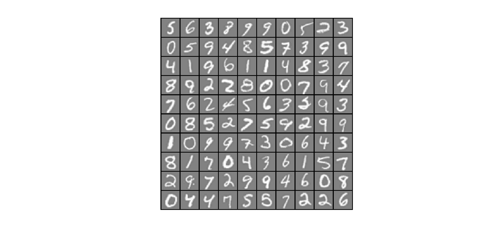
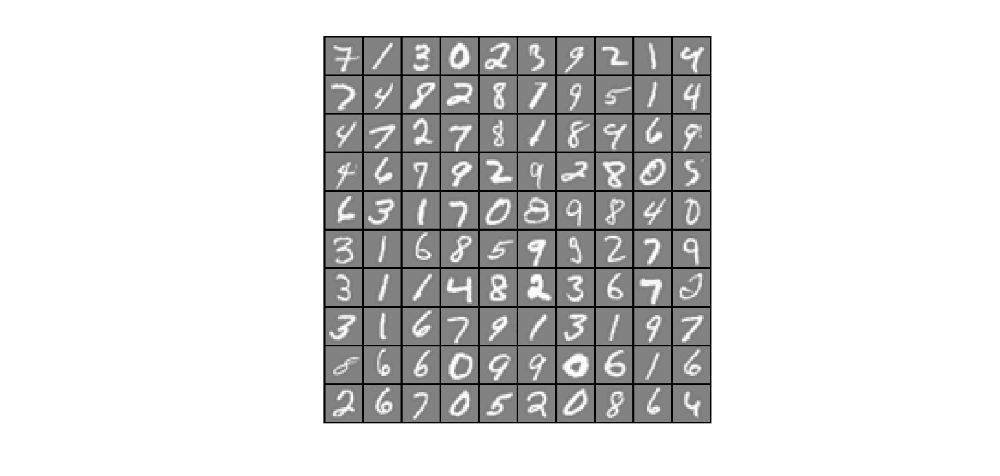

# Programming Assignment Multi-class Classification and Neural Networks

## ex3

Loading and Visualizing Data ...   
Program paused. Press enter to continue.       

Testing lrCostFunction() with regularization  
Cost: 2.534819  
Expected cost: 2.534819  
Gradients:  
 0.146561  
 -0.548558  
 0.724722  
 1.398003  
Expected gradients:  
 0.146561  
 -0.548558  
 0.724722  
 1.398003  
Program paused. Press enter to continue.   

Training One-vs-All Logistic Regression...  
Iteration    50 | Cost: 1.388119e-02  
Iteration    50 | Cost: 5.725256e-02  
Iteration    50 | Cost: 6.414981e-02  
Iteration    50 | Cost: 3.814018e-02  
Iteration    50 | Cost: 6.154087e-02  
Iteration    50 | Cost: 2.170421e-02  
Iteration    50 | Cost: 3.633756e-02  
Iteration    50 | Cost: 8.582019e-02  
Iteration    50 | Cost: 7.940793e-02  
Iteration    50 | Cost: 9.890577e-03  
Program paused. Press enter to continue.     

Training Set Accuracy: 94.880000

## ex3_nn

Loading and Visualizing Data ...  
Program paused. Press enter to continue.  

Loading Saved Neural Network Parameters ...  

Training Set Accuracy: 97.520000  
Program paused. Press enter to continue.   

Displaying Example Image    

Neural Network Prediction: 7 (digit 7)  
Paused - press enter to continue, q to exit:   

Displaying Example Image  

Neural Network Prediction: 8 (digit 8)  
Paused - press enter to continue, q to exit:  

Displaying Example Image  

Neural Network Prediction: 5 (digit 5)  
Paused - press enter to continue, q to exit:  q

## submit result 
==                                   Part Name |     Score | Feedback  
==                                   --------- |     ----- | --------  
==             Regularized Logistic Regression |  30 /  30 | Nice work!  
==              One-vs-All Classifier Training |  20 /  20 | Nice work!  
==            One-vs-All Classifier Prediction |  20 /  20 | Nice work!  
==          Neural Network Prediction Function |  30 /  30 | Nice work!  
==                                   --------------------------------  
== | 100 / 100 |
