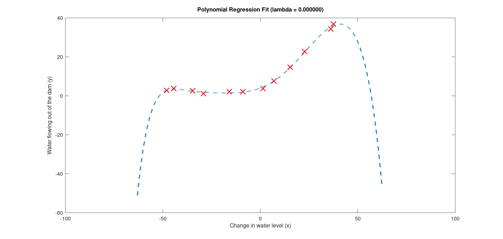

# Programming Assignment: Regularized Linear Regression and Bias/Variance

## ex5

Loading and Visualizing Data ...   
Program paused. Press enter to continue.  


Cost at theta = [1 ; 1]: 303.993192  
(this value should be about 303.993192)  
Program paused. Press enter to continue.  
Gradient at theta = [1 ; 1]:  [-15.303016; 598.250744]  
(this value should be about [-15.303016; 598.250744])  
Program paused. Press enter to continue.  

Iteration     2 | Cost: 2.237391e+01  
Program paused. Press enter to continue.  


Iteration     3 | Cost: 0.000000e+00  
Iteration     3 | Cost: 9.860761e-32  
Iteration     2 | Cost: 3.286595e+00    
Iteration    28 | Cost: 2.842678e+00  
Iteration    24 | Cost: 1.315405e+01  
Iteration    27 | Cost: 1.944396e+01  
Iteration    13 | Cost: 2.009852e+01  
Iteration    30 | Cost: 1.817286e+01  
Iteration    11 | Cost: 2.260941e+01  
Iteration    33 | Cost: 2.326146e+01  
Iteration    10 | Cost: 2.431725e+01  
Iteration     2 | Cost: 2.237391e+01  
\#Training Examples     Train Error     Cross Validation Error  
        1               0.000000        205.121096  
        2               0.000000        110.300366  
        3               3.286595        45.010231  
        4               2.842678        48.368911  
        5               13.154049       35.865165  
        6               19.443963       33.829962  
        7               20.098522       31.970986  
        8               18.172859       30.862446  
        9               22.609405       31.135998  
        10              23.261462       28.936207  
        11              24.317250       29.551432  
        12              22.373906       29.433818  
Program paused. Press enter to continue.  


Normalized Training Example 1:  
  1.000000  
  -0.362141  
  -0.755087  
  0.182226  
  -0.706190  
  0.306618  
  -0.590878  
  0.344516  
  -0.508481  

Program paused. Press enter to continue.  
Iteration   200 | Cost: 1.424831e-01  
Iteration     4 | Cost: 0.000000e+00  
Iteration    14 | Cost: 0.000000e+00  
Iteration    25 | Cost: 1.643460e-31  
Iteration    10 | Cost: 2.020322e-27  
Iteration   200 | Cost: 1.516202e-10  
Iteration   200 | Cost: 5.125367e-05  
Iteration   200 | Cost: 2.604884e-02  
Iteration   200 | Cost: 7.636934e-02  
Iteration   200 | Cost: 5.921217e-02  
Iteration   200 | Cost: 1.249924e-01  
Iteration   200 | Cost: 5.903377e-02  
Iteration   200 | Cost: 1.424831e-01  
Polynomial Regression (lambda = 0.000000)  

\#Training Examples     Train Error     Cross Validation Error  
        1               0.000000        160.721900  
        2               0.000000        160.121510  
        3               0.000000        61.754825  
        4               0.000000        61.928895  
        5               0.000000        6.597975  
        6               0.000051        10.476365  
        7               0.026049        10.654568  
        8               0.076369        5.293786  
        9               0.059212        12.809828  
        10              0.124992        7.343872  
        11              0.059034        9.565488  
        12              0.142483        16.299993  
Program paused. Press enter to continue.  




Program paused. Press enter to continue.  
Iteration   200 | Cost: 1.424831e-01  
Iteration   200 | Cost: 1.829340e-01  
Iteration   200 | Cost: 2.524427e-01  
Iteration   200 | Cost: 3.851090e-01  
Iteration   200 | Cost: 6.692749e-01  
Iteration   168 | Cost: 1.443470e+00  
Iteration    90 | Cost: 3.101591e+00  
Iteration    67 | Cost: 7.268148e+00  
Iteration    36 | Cost: 1.586769e+01  
Iteration    27 | Cost: 3.337220e+01  
lambda          Train Error     Validation Error  
 0.000000       0.142483        16.299993  
 0.001000       0.141457        15.228917  
 0.003000       0.185825        19.046839  
 0.010000       0.222819        17.155408  
 0.030000       0.281862        12.828583  
 0.100000       0.459318        7.587015  
 0.300000       0.921760        4.636833  
 1.000000       2.076188        4.260626  
 3.000000       4.901351        3.822907  
 10.000000      16.092213       9.945508  
Program paused. Press enter to continue.  


## submit result

==                                   Part Name |     Score | Feedback  
==                                   --------- |     ----- | --------  
== Regularized Linear Regression Cost Function |  25 /  25 | Nice work!  
==      Regularized Linear Regression Gradient |  25 /  25 | Nice work!  
==                              Learning Curve |  20 /  20 | Nice work!  
==                  Polynomial Feature Mapping |  10 /  10 | Nice work!  
==                            Validation Curve |  20 /  20 | Nice work!  
==                                   --------------------------------  
==                                             | 100 / 100 |  


## Optional (ungraded) exercise

### Adjusting the regularization parameter
```octave
% ex5.m
%% =========== Part 7: Learning Curve for Polynomial Regression =============
%  Now, you will get to experiment with polynomial regression with multiple
%  values of lambda. The code below runs polynomial regression with 
%  lambda = 0. You should try running the code with different values of
%  lambda to see how the fit and learning curve change.
%

lambda = 0;
[theta] = trainLinearReg(X_poly, y, lambda);
```

We will modify lambda to 1 or 100.

```octave
lambda = 1;
[theta] = trainLinearReg(X_poly, y, lambda);
```


```octave
lambda = 100;
[theta] = trainLinearReg(X_poly, y, lambda);
```

```octave
axis([0 13 0 150])
```


### Computing test set error

We can get test set from Xtest and ytest.

```octave
% ex5.m
% Load from ex5data1: 
% You will have X, y, Xval, yval, Xtest, ytest in your environment
load ('ex5data1.mat');
```

We find best value of lambda is 3 according result mentioned above.

```octave
% ex5.m
%% Optional (ungraded) exercise: Computing test set error
lambda = 3;
theta = trainLinearReg(X_poly_test, ytest, lambda);
test_error = linearRegCostFunction(X_poly_test, ytest, theta, lambda);
fprintf('Computing test set error(lambda = %f): %f', lambda, test_error);
fprintf('Program paused. Press enter to continue.\n');
pause;
```

Input:  

Iteration    43 | Cost: 8.884132e+00   
Computing test set error(lambda = 3.000000): 8.884132    

### Plotting learning curves with randomly selected examples
```octave
% ex5.m
%% Optional (ungraded) exercise: Plotting learning curves with randomly selected examples
lambda = 0.01;
iter = 50;

train_error_res = zeros(m, 1);
val_error_res = zeros(m, 1);

for i = 1: m
  for j = 1: iter
    rand_index = randperm(m, i);
     
     theta = trainLinearReg(X_poly(rand_index,:), y(rand_index,:), lambda);
     error_train = linearRegCostFunction(X_poly(rand_index,:), y(rand_index,:), theta, lambda);
     error_val = linearRegCostFunction(X_poly_val(rand_index,:), yval(rand_index,:), theta, lambda);
    
    train_error_res(i) = train_error_res(i) + error_train;
    val_error_res(i) = val_error_res(i) + error_val;
  endfor
endfor

train_error_res = train_error_res ./ iter;
val_error_res = val_error_res ./ iter;

plot(1: m, train_error_res, 1: m, val_error_res);
title('Learning curve for linear regression');
legend('Train', 'Cross Validation');
xlabel('Number of training examples');
ylabel('Error');
axis([0 13 0 100]);
```

Input:


Iteration     5 | Cost: 3.842625e-33    
Iteration     6 | Cost: 1.568378e-29    
Iteration    25 | Cost: 5.682713e-32    
Iteration    25 | Cost: 5.682713e-32    
Iteration    38 | Cost: 3.419718e-31    
Iteration    86 | Cost: 0.000000e+009    
Iteration     6 | Cost: 1.568378e-29    
Iteration     3 | Cost: 2.241619e-31    
Iteration    14 | Cost: 2.951301e-29    
Iteration     6 | Cost: 2.526104e-29    
Iteration    79 | Cost: 3.625751e-27    
Iteration    38 | Cost: 3.419718e-31    
Iteration    25 | Cost: 5.682713e-32    
Iteration     6 | Cost: 2.526104e-29    
Iteration     6 | Cost: 1.328066e-31    
Iteration    79 | Cost: 3.625751e-27    
Iteration    79 | Cost: 3.625751e-27    
Iteration     5 | Cost: 3.842625e-33    
Iteration     6 | Cost: 1.328066e-31    
Iteration    38 | Cost: 3.419718e-31    
Iteration     6 | Cost: 2.526104e-29    
Iteration     6 | Cost: 2.526104e-29    
Iteration    24 | Cost: 8.632482e-31    
Iteration     5 | Cost: 3.842625e-33    
Iteration     3 | Cost: 2.241619e-31    
Iteration    14 | Cost: 2.951301e-29    
Iteration     6 | Cost: 1.568378e-29    
Iteration    25 | Cost: 5.682713e-32    
Iteration    38 | Cost: 3.419718e-31    
Iteration     3 | Cost: 2.241619e-31    
Iteration    14 | Cost: 2.951301e-29    
Iteration    41 | Cost: 5.018474e-32    
Iteration    14 | Cost: 2.951301e-29    
Iteration     5 | Cost: 3.842625e-33    
Iteration    24 | Cost: 8.632482e-31    
Iteration     6 | Cost: 1.328066e-31    
Iteration     3 | Cost: 2.241619e-31    
Iteration    79 | Cost: 3.625751e-27    
Iteration    86 | Cost: 0.000000e+009    
Iteration    14 | Cost: 2.951301e-29    
Iteration    14 | Cost: 2.951301e-29   
Iteration    38 | Cost: 3.419718e-31    
Iteration     3 | Cost: 2.241619e-31    
Iteration    41 | Cost: 5.018474e-32    
Iteration     6 | Cost: 1.568378e-29    
Iteration     6 | Cost: 1.568378e-29    
Iteration    25 | Cost: 5.682713e-32    
Iteration     3 | Cost: 2.241619e-31    
Iteration    38 | Cost: 3.419718e-31    
Iteration    14 | Cost: 2.951301e-29    
Iteration     5 | Cost: 1.872680e-01    
Iteration    93 | Cost: 6.211084e-01    
Iteration    42 | Cost: 2.363257e-01    
Iteration    53 | Cost: 2.858446e-04    
Iteration     5 | Cost: 6.006608e-03    
Iteration    48 | Cost: 5.486574e-01    
Iteration    53 | Cost: 2.568504e-04    
Iteration    30 | Cost: 5.619162e-02    
Iteration   105 | Cost: 9.933984e-02    
Iteration    86 | Cost: 3.488426e-01    
Iteration    94 | Cost: 6.316032e-03    
Iteration     3 | Cost: 3.351639e-01    
Iteration    50 | Cost: 1.479423e-01    
Iteration     3 | Cost: 3.208624e-01    
Iteration    94 | Cost: 6.316032e-03    
Iteration     5 | Cost: 6.006608e-03    
Iteration    94 | Cost: 6.316032e-03    
Iteration    94 | Cost: 1.535417e-04    
Iteration    81 | Cost: 8.770616e-04    
Iteration    53 | Cost: 2.858446e-04    
Iteration    80 | Cost: 1.930013e-03    
Iteration     3 | Cost: 3.351639e-01    
Iteration    68 | Cost: 7.969131e-01    
Iteration    51 | Cost: 3.066675e-01    
Iteration    64 | Cost: 8.624860e-01    
Iteration    54 | Cost: 9.133622e-01    
Iteration    39 | Cost: 2.629309e-01    
Iteration    47 | Cost: 9.869183e-03    
Iteration    53 | Cost: 2.568504e-04    
Iteration    64 | Cost: 4.401330e-02    
Iteration    94 | Cost: 6.316032e-03    
Iteration     3 | Cost: 3.351639e-01        
Iteration    62 | Cost: 9.104315e-04    
Iteration    78 | Cost: 8.354382e-02    
Iteration    64 | Cost: 2.495749e-06    
Iteration     3 | Cost: 3.146498e-01    
Iteration    58 | Cost: 2.942500e-01    
Iteration    70 | Cost: 3.287950e-01    
Iteration    20 | Cost: 2.481126e-01    
Iteration    73 | Cost: 1.915965e-05    
Iteration    50 | Cost: 1.479423e-01    
Iteration    62 | Cost: 9.104315e-04    
Iteration    75 | Cost: 1.103080e-01    
Iteration    53 | Cost: 2.858446e-04    
Iteration    50 | Cost: 1.479423e-01    
Iteration    48 | Cost: 5.373629e-04    
Iteration     3 | Cost: 6.887832e-01    
Iteration    25 | Cost: 2.278273e-01    
Iteration    48 | Cost: 5.486574e-01    
Iteration    73 | Cost: 1.915965e-05    
Iteration   189 | Cost: 4.565377e-01    
Iteration     4 | Cost: 2.041123e-01    
Iteration   156 | Cost: 6.626703e-01    
Iteration   129 | Cost: 2.111319e-01    
Iteration    89 | Cost: 1.522816e-01    
Iteration     7 | Cost: 4.500149e-01    
Iteration    60 | Cost: 2.022609e-01    
Iteration   200 | Cost: 4.083093e-03    
Iteration   195 | Cost: 1.174013e-01    
Iteration   200 | Cost: 3.169788e-02    
Iteration   190 | Cost: 1.728297e-01    
Iteration   155 | Cost: 5.636259e-01    
Iteration    49 | Cost: 1.656928e-04    
Iteration   125 | Cost: 2.142974e-01    
Iteration   200 | Cost: 1.812539e-03    
Iteration   174 | Cost: 6.152714e-01    
Iteration   200 | Cost: 1.153524e-02    
Iteration   200 | Cost: 1.028110e-02    
Iteration   127 | Cost: 1.817617e-01    
Iteration   200 | Cost: 5.186723e-01    
Iteration    47 | Cost: 4.294898e-01    
Iteration   170 | Cost: 1.284606e-03    
Iteration   200 | Cost: 7.046642e-01    
Iteration   159 | Cost: 4.505059e-01    
Iteration   153 | Cost: 1.697834e-01    
Iteration    90 | Cost: 1.687364e-01    
Iteration   166 | Cost: 6.815302e-04    
Iteration   158 | Cost: 9.934275e-02    
Iteration     4 | Cost: 9.340414e-02    
Iteration     4 | Cost: 9.340414e-02    
Iteration   200 | Cost: 7.046642e-01    
Iteration    72 | Cost: 1.059613e-01    
Iteration    97 | Cost: 2.260612e-01    
Iteration   200 | Cost: 4.592084e-01    
Iteration   200 | Cost: 3.117097e-03    
Iteration   167 | Cost: 5.756742e-01    
Iteration     4 | Cost: 9.340414e-02    
Iteration   200 | Cost: 5.784709e-01    
Iteration   200 | Cost: 5.261349e-01    
Iteration   135 | Cost: 2.114523e-01    
Iteration     5 | Cost: 4.906204e-01    
Iteration   114 | Cost: 2.226670e-01    
Iteration   134 | Cost: 4.267579e-02    
Iteration   200 | Cost: 7.388511e-02    
Iteration   149 | Cost: 2.348483e-01    
Iteration   134 | Cost: 4.267579e-02    
Iteration   144 | Cost: 2.245439e-01    
Iteration   176 | Cost: 3.750007e-01    
Iteration     4 | Cost: 3.690341e-02    
Iteration   200 | Cost: 3.117097e-03            
Iteration   200 | Cost: 2.802530e-01        
Iteration   200 | Cost: 4.318918e-01    
Iteration   200 | Cost: 1.581671e-01    
Iteration   148 | Cost: 1.283041e-01    
Iteration   200 | Cost: 4.255366e-01    
Iteration   200 | Cost: 1.706876e-01    
Iteration   200 | Cost: 5.437476e-02    
Iteration    93 | Cost: 5.818136e-01    
Iteration   200 | Cost: 3.974253e-01    
Iteration   200 | Cost: 4.820384e-01    
Iteration   149 | Cost: 2.921119e-01    
Iteration   200 | Cost: 5.322902e-01    
Iteration   200 | Cost: 1.663971e-01    
Iteration   200 | Cost: 1.110689e-01    
Iteration   163 | Cost: 1.777408e-01    
Iteration   195 | Cost: 3.477448e-02    
Iteration   200 | Cost: 5.618471e-01    
Iteration   200 | Cost: 3.017126e-01    
Iteration   200 | Cost: 5.131962e-01    
Iteration   200 | Cost: 5.560838e-01    
Iteration   200 | Cost: 3.020285e-01    
Iteration   192 | Cost: 4.568318e-01    
Iteration   200 | Cost: 4.761052e-01    
Iteration   200 | Cost: 4.640366e-01    
Iteration   198 | Cost: 4.318365e-01    
Iteration   200 | Cost: 4.451588e-01    
Iteration   200 | Cost: 4.161289e-01    
Iteration   129 | Cost: 1.706876e-01    
Iteration   200 | Cost: 1.672706e-01    
Iteration   200 | Cost: 4.780069e-01    
Iteration   200 | Cost: 4.670150e-01    
Iteration   200 | Cost: 1.528349e-01    
Iteration   200 | Cost: 5.743749e-01    
Iteration   200 | Cost: 3.972276e-01    
Iteration   200 | Cost: 4.977015e-01    
Iteration   200 | Cost: 5.131962e-01    
Iteration   141 | Cost: 1.274639e-01    
Iteration   200 | Cost: 1.621246e-01    
Iteration   200 | Cost: 3.560427e-01    
Iteration   200 | Cost: 1.701793e-01    
Iteration   200 | Cost: 3.341888e-01    
Iteration   200 | Cost: 1.663965e-01    
Iteration   195 | Cost: 4.112752e-01        
Iteration   200 | Cost: 4.670148e-01    
Iteration   152 | Cost: 2.072168e-01    
Iteration   200 | Cost: 2.929742e-01    
Iteration   170 | Cost: 4.108311e-01    
Iteration     6 | Cost: 1.699105e-01    
Iteration   181 | Cost: 4.112408e-01    
Iteration   177 | Cost: 4.294138e-01    
Iteration   200 | Cost: 5.415363e-01  
Iteration   200 | Cost: 4.508303e-01  
Iteration   185 | Cost: 3.801941e-01  
Iteration   200 | Cost: 4.714654e-01  
Iteration   200 | Cost: 1.622219e-01  
Iteration   200 | Cost: 3.325664e-01  
Iteration   200 | Cost: 5.048684e-01  
Iteration   200 | Cost: 3.977175e-01  
Iteration   200 | Cost: 1.426984e-01  
Iteration   200 | Cost: 5.646162e-01  
Iteration   200 | Cost: 1.655720e-01  
Iteration   200 | Cost: 2.563761e-01  
Iteration   200 | Cost: 2.969910e-01  
Iteration   200 | Cost: 3.734807e-01  
Iteration   200 | Cost: 3.390168e-01  
Iteration   200 | Cost: 4.810999e-01  
Iteration   200 | Cost: 1.655719e-01  
Iteration   200 | Cost: 4.495294e-01  
Iteration   200 | Cost: 6.449140e-01  
Iteration   200 | Cost: 2.418914e-01  
Iteration   200 | Cost: 2.354913e-01  
Iteration   191 | Cost: 2.790286e-01  
Iteration   200 | Cost: 2.866034e-01  
Iteration   200 | Cost: 3.734806e-01  
Iteration   200 | Cost: 3.454364e-02  
Iteration   200 | Cost: 4.582701e-01  
Iteration   200 | Cost: 3.313416e-02  
Iteration   200 | Cost: 1.783364e-01  
Iteration   200 | Cost: 5.698284e-01  
Iteration   200 | Cost: 3.216962e-01  
Iteration   200 | Cost: 4.243381e-01  
Iteration   200 | Cost: 4.256751e-01  
Iteration   200 | Cost: 3.204626e-01  
Iteration   200 | Cost: 2.382414e-01  
Iteration   200 | Cost: 1.362452e-01  
Iteration   200 | Cost: 3.049702e-01  
Iteration   200 | Cost: 4.502432e-01  
Iteration   200 | Cost: 1.554409e-01  
Iteration   200 | Cost: 3.595523e-01  
Iteration   200 | Cost: 1.346883e-01  
Iteration   200 | Cost: 1.884711e-01  
Iteration   200 | Cost: 4.239708e-01  
Iteration    11 | Cost: 3.148022e-01  
Iteration   200 | Cost: 3.337132e-01  
Iteration   200 | Cost: 2.955711e-01  
Iteration   200 | Cost: 4.041295e-01  
Iteration   200 | Cost: 3.010886e-01  
Iteration   200 | Cost: 1.662989e-01  
Iteration   200 | Cost: 3.419028e-01  
Iteration   200 | Cost: 3.610487e-01  
Iteration   200 | Cost: 3.647005e-01  
Iteration   200 | Cost: 3.051654e-01  
Iteration   200 | Cost: 4.375389e-01  
Iteration   200 | Cost: 5.337223e-01  
Iteration   200 | Cost: 3.381592e-01  
Iteration   200 | Cost: 2.449414e-01  
Iteration   200 | Cost: 4.435866e-01  
Iteration   200 | Cost: 3.947678e-01  
Iteration   200 | Cost: 3.382351e-01  
Iteration   200 | Cost: 3.548751e-01  
Iteration   200 | Cost: 3.958037e-01  
Iteration   200 | Cost: 3.744893e-01  
Iteration   200 | Cost: 3.779436e-01  
Iteration   200 | Cost: 2.561213e-01  
Iteration   200 | Cost: 2.331640e-01  
Iteration   200 | Cost: 2.655583e-01  
Iteration   200 | Cost: 4.594107e-01  
Iteration   200 | Cost: 4.405729e-01  
Iteration   200 | Cost: 4.355560e-01  
Iteration   200 | Cost: 3.979290e-01  
Iteration   200 | Cost: 2.253535e-01  
Iteration   200 | Cost: 2.370574e-01  
Iteration   200 | Cost: 3.543229e-01  
Iteration   200 | Cost: 3.867561e-01  
Iteration   200 | Cost: 2.455088e-01  
Iteration   200 | Cost: 3.746310e-01  
Iteration   200 | Cost: 2.085242e-01  
Iteration   129 | Cost: 5.592525e-01  
Iteration   200 | Cost: 1.404192e-01  
Iteration   200 | Cost: 2.863140e-01  
Iteration   200 | Cost: 3.909919e-01  
Iteration   200 | Cost: 3.548443e-01  
Iteration   200 | Cost: 4.895447e-01  
Iteration   200 | Cost: 3.839821e-01  
Iteration   193 | Cost: 2.811358e-01  
Iteration   185 | Cost: 3.316965e-01  
Iteration   200 | Cost: 2.034807e-01  
Iteration   200 | Cost: 3.844951e-01  
Iteration   200 | Cost: 2.784044e-01  
Iteration   200 | Cost: 3.308410e-01  
Iteration   200 | Cost: 4.065959e-01  
Iteration   200 | Cost: 2.491424e-01  
Iteration    50 | Cost: 1.537652e-01  
Iteration   200 | Cost: 3.117917e-01  
Iteration   131 | Cost: 4.238993e-01  
Iteration   200 | Cost: 1.595772e-01  
Iteration   200 | Cost: 3.322085e-01  
Iteration   197 | Cost: 3.250827e-01  
Iteration   200 | Cost: 3.937560e-01  
Iteration   200 | Cost: 1.745543e-01  
Iteration   200 | Cost: 1.299881e-01  
Iteration   200 | Cost: 2.306973e-01  
Iteration   200 | Cost: 4.267227e-01  
Iteration   200 | Cost: 3.009731e-01  
Iteration   200 | Cost: 2.660263e-01  
Iteration   200 | Cost: 2.743214e-01  
Iteration   200 | Cost: 3.928663e-01  
Iteration   200 | Cost: 4.276094e-01  
Iteration   200 | Cost: 4.475890e-01  
Iteration   200 | Cost: 4.775321e-01  
Iteration   200 | Cost: 3.041523e-01  
Iteration   200 | Cost: 1.438480e-01  
Iteration   200 | Cost: 3.664239e-01  
Iteration   200 | Cost: 1.274853e-01  
Iteration   200 | Cost: 4.059128e-01  
Iteration   200 | Cost: 2.681576e-01  
Iteration   200 | Cost: 2.115133e-01  
Iteration   200 | Cost: 4.615803e-01  
Iteration   200 | Cost: 1.790235e-01  
Iteration   200 | Cost: 2.926159e-01  
Iteration   200 | Cost: 3.249720e-01  
Iteration   200 | Cost: 1.226534e-01  
Iteration   200 | Cost: 4.442449e-01  
Iteration   200 | Cost: 4.001218e-01  
Iteration   200 | Cost: 3.365414e-01  
Iteration   200 | Cost: 3.211439e-01  
Iteration   200 | Cost: 3.690357e-01  
Iteration   200 | Cost: 2.281480e-01  
Iteration   200 | Cost: 3.037163e-01  
Iteration   200 | Cost: 3.978680e-01  
Iteration   200 | Cost: 4.733610e-01  
Iteration   200 | Cost: 3.432901e-01  
Iteration   200 | Cost: 1.501946e-01  
Iteration   200 | Cost: 3.464053e-01  
Iteration   200 | Cost: 2.395619e-01  
Iteration   200 | Cost: 1.791104e-01  
Iteration   200 | Cost: 3.811629e-01  
Iteration   200 | Cost: 4.760877e-01  
Iteration   200 | Cost: 3.437760e-01  
Iteration   200 | Cost: 3.106423e-01  
Iteration   200 | Cost: 4.780414e-01  
Iteration   200 | Cost: 3.790472e-01  
Iteration   200 | Cost: 3.162128e-01  
Iteration   200 | Cost: 2.315093e-01  
Iteration   200 | Cost: 4.921042e-01  
Iteration   200 | Cost: 4.988342e-01  
Iteration   200 | Cost: 2.682011e-01  
Iteration   200 | Cost: 5.111490e-01  
Iteration   200 | Cost: 2.828718e-01  
Iteration   200 | Cost: 3.799506e-01  
Iteration   200 | Cost: 3.656883e-01  
Iteration   200 | Cost: 3.387479e-01  
Iteration   200 | Cost: 4.632796e-01  
Iteration   200 | Cost: 3.657073e-01  
Iteration   200 | Cost: 2.981874e-01  
Iteration   200 | Cost: 3.574609e-01  
Iteration   200 | Cost: 4.030621e-01  
Iteration   200 | Cost: 4.700427e-01  
Iteration   200 | Cost: 3.866026e-01  
Iteration   200 | Cost: 3.537237e-01  
Iteration   200 | Cost: 1.122700e-01  
Iteration   200 | Cost: 1.875765e-01  
Iteration   200 | Cost: 4.018337e-01  
Iteration   200 | Cost: 3.466213e-01  
Iteration   200 | Cost: 4.498304e-01  
Iteration   200 | Cost: 3.471329e-01  
Iteration   200 | Cost: 3.584808e-01  
Iteration   200 | Cost: 3.314563e-01  
Iteration   200 | Cost: 3.203449e-01  
Iteration   200 | Cost: 5.315525e-01  
Iteration   200 | Cost: 2.419503e-01  
Iteration   200 | Cost: 2.859628e-01  
Iteration   200 | Cost: 2.822158e-01  
Iteration   200 | Cost: 5.302957e-01  
Iteration   200 | Cost: 3.701295e-01  
Iteration   200 | Cost: 3.652179e-01  
Iteration   200 | Cost: 3.975376e-01  
Iteration   200 | Cost: 2.832783e-01  
Iteration   200 | Cost: 2.950971e-01  
Iteration   200 | Cost: 3.667343e-01  
Iteration   200 | Cost: 3.754518e-01  
Iteration   200 | Cost: 4.462232e-01  
Iteration   200 | Cost: 3.838658e-01  
Iteration   200 | Cost: 2.657071e-01  
Iteration   200 | Cost: 2.801066e-01  
Iteration   200 | Cost: 3.816005e-01  
Iteration   200 | Cost: 3.487162e-01  
Iteration   200 | Cost: 3.534555e-01  
Iteration   200 | Cost: 3.860265e-01  
Iteration   200 | Cost: 4.132654e-01  
Iteration   200 | Cost: 3.585923e-01  
Iteration   200 | Cost: 2.947489e-01  
Iteration   200 | Cost: 4.246612e-01  
Iteration   200 | Cost: 4.599068e-01  
Iteration   200 | Cost: 2.796506e-01  
Iteration   200 | Cost: 3.806190e-01  
Iteration   200 | Cost: 2.800849e-01  
Iteration   200 | Cost: 4.518226e-01  
Iteration   200 | Cost: 1.875803e-01  
Iteration   200 | Cost: 2.891337e-01  
Iteration   200 | Cost: 4.175987e-01  
Iteration   200 | Cost: 3.600941e-01  
Iteration   200 | Cost: 4.493642e-01  
Iteration   200 | Cost: 3.634416e-01  
Iteration   200 | Cost: 3.385147e-01  
Iteration   200 | Cost: 3.859575e-01  
Iteration   200 | Cost: 3.043312e-01  
Iteration   200 | Cost: 1.320701e-01  
Iteration   200 | Cost: 2.233252e-01  
Iteration   200 | Cost: 3.859573e-01  
Iteration   200 | Cost: 4.119744e-01  
Iteration   200 | Cost: 4.030798e-01  
Iteration   200 | Cost: 4.118844e-01  
Iteration   200 | Cost: 4.564842e-01  
Iteration   200 | Cost: 4.478945e-01  
Iteration   200 | Cost: 3.135275e-01  
Iteration   200 | Cost: 3.998675e-01  
Iteration   200 | Cost: 3.717443e-01  
Iteration   200 | Cost: 3.657512e-01  
Iteration   200 | Cost: 2.690548e-01  
Iteration   200 | Cost: 2.237481e-01  
Iteration   200 | Cost: 4.002543e-01  
Iteration   200 | Cost: 4.767519e-01  
Iteration   200 | Cost: 3.696299e-01  
Iteration   200 | Cost: 3.761376e-01  
Iteration   200 | Cost: 3.742597e-01  
Iteration   200 | Cost: 3.893002e-01  
Iteration   200 | Cost: 3.288742e-01  
Iteration   200 | Cost: 3.605602e-01  
Iteration   200 | Cost: 4.493551e-01  
Iteration   200 | Cost: 3.881059e-01  
Iteration   200 | Cost: 2.801663e-01  
Iteration   200 | Cost: 3.922892e-01  
Iteration   200 | Cost: 2.695615e-01  
Iteration   200 | Cost: 3.417692e-01  
Iteration   200 | Cost: 4.086115e-01  
Iteration   200 | Cost: 4.759590e-01  
Iteration   200 | Cost: 4.959826e-01  
Iteration   200 | Cost: 3.291374e-01  
Iteration   200 | Cost: 3.979207e-01  
Iteration   200 | Cost: 3.983884e-01  
Iteration   200 | Cost: 2.801693e-01  
Iteration   200 | Cost: 3.323315e-01  
Iteration   200 | Cost: 3.821485e-01  
Iteration   200 | Cost: 3.945643e-01  
Iteration   200 | Cost: 3.249874e-01  
Iteration   200 | Cost: 4.479291e-01  
Iteration   200 | Cost: 3.847292e-01  
Iteration   200 | Cost: 2.219530e-01  
Iteration   200 | Cost: 4.768750e-01  
Iteration   200 | Cost: 3.772449e-01  
Iteration   200 | Cost: 4.082536e-01  
Iteration   200 | Cost: 3.579384e-01  
Iteration   200 | Cost: 4.538987e-01  
Iteration   200 | Cost: 3.241986e-01  
Iteration   200 | Cost: 3.627452e-01  
Iteration   200 | Cost: 3.610981e-01  
Iteration   200 | Cost: 3.738306e-01  
Iteration   200 | Cost: 3.750307e-01  
Iteration   200 | Cost: 3.473889e-01  
Iteration   200 | Cost: 3.800159e-01  
Iteration   200 | Cost: 3.349442e-01  
Iteration   200 | Cost: 4.035894e-01  
Iteration   200 | Cost: 3.132558e-01  
Iteration   200 | Cost: 4.521943e-01  
Iteration   200 | Cost: 2.932292e-01  
Iteration   200 | Cost: 3.608432e-01  
Iteration   200 | Cost: 3.564361e-01  
Iteration   200 | Cost: 3.646578e-01  
Iteration   200 | Cost: 3.088727e-01  
Iteration   200 | Cost: 3.605638e-01  
Iteration   200 | Cost: 3.646536e-01  
Iteration   200 | Cost: 3.445697e-01  
Iteration   200 | Cost: 4.309478e-01  
Iteration   200 | Cost: 3.543686e-01  
Iteration   200 | Cost: 3.680273e-01  
Iteration   200 | Cost: 3.632874e-01  
Iteration   200 | Cost: 3.070095e-01  
Iteration   200 | Cost: 2.492395e-01  
Iteration   200 | Cost: 4.564991e-01  
Iteration   200 | Cost: 2.492450e-01  
Iteration   200 | Cost: 3.814691e-01  
Iteration   200 | Cost: 3.543471e-01  
Iteration   200 | Cost: 4.320972e-01  
Iteration   200 | Cost: 2.913195e-01  
Iteration   200 | Cost: 3.340548e-01  
Iteration   200 | Cost: 3.646566e-01  
Iteration   200 | Cost: 3.738311e-01  
Iteration   200 | Cost: 3.597098e-01  
Iteration   200 | Cost: 3.611111e-01  
Iteration   200 | Cost: 3.596776e-01  
Iteration   200 | Cost: 4.333478e-01  
Iteration   200 | Cost: 3.822396e-01  
Iteration   200 | Cost: 3.130455e-01  
Iteration   200 | Cost: 3.749434e-01  
Iteration   200 | Cost: 3.070282e-01  
Iteration   200 | Cost: 3.460017e-01  
Iteration   200 | Cost: 3.823588e-01  
Iteration   200 | Cost: 4.343284e-01  
Iteration   200 | Cost: 3.564083e-01  
Iteration   200 | Cost: 3.969414e-01  
Iteration   200 | Cost: 3.969422e-01  
Iteration   200 | Cost: 3.992418e-01  
Iteration   200 | Cost: 3.476863e-01  
Iteration   200 | Cost: 4.200170e-01  
Iteration   200 | Cost: 3.476930e-01  
Iteration   200 | Cost: 3.431324e-01  
Iteration   200 | Cost: 3.474859e-01  
Iteration   200 | Cost: 3.718267e-01  
Iteration   200 | Cost: 4.126208e-01  
Iteration   200 | Cost: 4.126576e-01  
Iteration   200 | Cost: 3.431292e-01  
Iteration   200 | Cost: 3.431304e-01  
Iteration   200 | Cost: 3.718340e-01  
Iteration   200 | Cost: 3.969412e-01  
Iteration   200 | Cost: 4.200128e-01  
Iteration   200 | Cost: 3.474280e-01  
Iteration   200 | Cost: 3.299934e-01  
Iteration   200 | Cost: 4.150876e-01  
Iteration   200 | Cost: 3.431834e-01  
Iteration   200 | Cost: 3.718682e-01  
Iteration   200 | Cost: 4.150891e-01  
Iteration   200 | Cost: 3.431321e-01  
Iteration   200 | Cost: 4.126185e-01  
Iteration   200 | Cost: 4.126238e-01  
Iteration   200 | Cost: 4.126664e-01  
Iteration   200 | Cost: 3.289580e-01  
Iteration   200 | Cost: 3.969414e-01  
Iteration   200 | Cost: 3.718511e-01  
Iteration   200 | Cost: 3.431338e-01  
Iteration   200 | Cost: 3.431367e-01  
Iteration   200 | Cost: 3.474351e-01  
Iteration   200 | Cost: 4.128154e-01  
Iteration   200 | Cost: 3.992433e-01  
Iteration   200 | Cost: 3.431289e-01  
Iteration   200 | Cost: 4.151036e-01  
Iteration   200 | Cost: 3.431651e-01  
Iteration   200 | Cost: 4.150931e-01  
Iteration   200 | Cost: 3.992417e-01  
Iteration   200 | Cost: 4.126599e-01  
Iteration   200 | Cost: 4.150840e-01  
Iteration   200 | Cost: 4.151008e-01  
Iteration   200 | Cost: 3.431303e-01  
Iteration   200 | Cost: 4.126458e-01  
Iteration   200 | Cost: 4.200616e-01  
Iteration   200 | Cost: 4.126153e-01  
Iteration   200 | Cost: 3.299942e-01  
Iteration   200 | Cost: 3.431298e-01  
Iteration   200 | Cost: 3.992805e-01  
Iteration   200 | Cost: 3.476791e-01  
Iteration   200 | Cost: 3.850887e-01  
Iteration   200 | Cost: 3.850778e-01  
Iteration   200 | Cost: 3.851179e-01  
Iteration   200 | Cost: 3.850723e-01  
Iteration   200 | Cost: 3.850629e-01  
Iteration   200 | Cost: 3.850923e-01  
Iteration   200 | Cost: 3.850737e-01  
Iteration   200 | Cost: 3.850630e-01  
Iteration   200 | Cost: 3.850645e-01  
Iteration   200 | Cost: 3.850633e-01  
Iteration   200 | Cost: 3.850729e-01  
Iteration   200 | Cost: 3.850652e-01  
Iteration   200 | Cost: 3.850654e-01  
Iteration   200 | Cost: 3.850823e-01  
Iteration   200 | Cost: 3.850745e-01  
Iteration   200 | Cost: 3.850780e-01      
Iteration   200 | Cost: 3.850648e-01  
Iteration   200 | Cost: 3.850754e-01      
Iteration   200 | Cost: 3.850648e-01      
Iteration   200 | Cost: 3.850707e-01      
Iteration   200 | Cost: 3.850633e-01      
Iteration   200 | Cost: 3.850681e-01          
Iteration   200 | Cost: 3.850901e-01      
Iteration   200 | Cost: 3.850652e-01      
Iteration   200 | Cost: 3.850679e-01      
Iteration   200 | Cost: 3.850631e-01      
Iteration   200 | Cost: 3.850648e-01      
Iteration   200 | Cost: 3.850808e-01      
Iteration   200 | Cost: 3.851082e-01      
Iteration   200 | Cost: 3.853301e-01      
Iteration   200 | Cost: 3.850629e-01      
Iteration   200 | Cost: 3.851510e-01      
Iteration   200 | Cost: 3.851426e-01      
Iteration   200 | Cost: 3.850786e-01      
Iteration   200 | Cost: 3.850868e-01      
Iteration   200 | Cost: 3.850739e-01      
Iteration   200 | Cost: 3.850632e-01      
Iteration   200 | Cost: 3.850629e-01      
Iteration   200 | Cost: 3.850974e-01      
Iteration   200 | Cost: 3.851286e-01      
Iteration   200 | Cost: 3.851249e-01      
Iteration   200 | Cost: 3.850630e-01      
Iteration   200 | Cost: 3.851484e-01      
Iteration   200 | Cost: 3.854167e-01      
Iteration   200 | Cost: 3.850693e-01      
Iteration   200 | Cost: 3.854607e-01      
Iteration   200 | Cost: 3.850653e-01      
Iteration   200 | Cost: 3.852173e-01      
Iteration   200 | Cost: 3.850643e-01      
Iteration   200 | Cost: 3.850632e-01           
