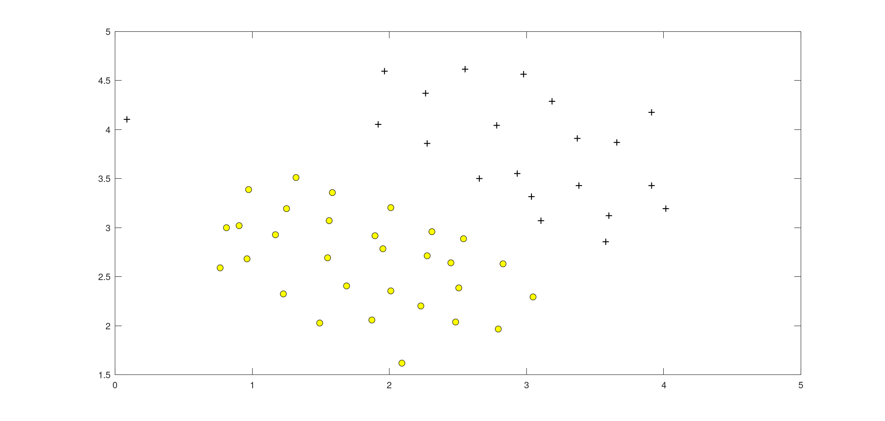
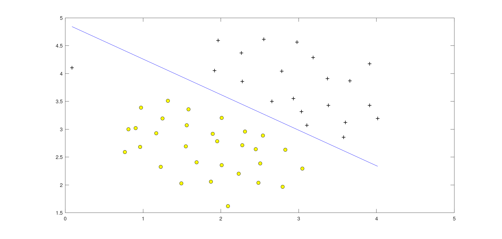
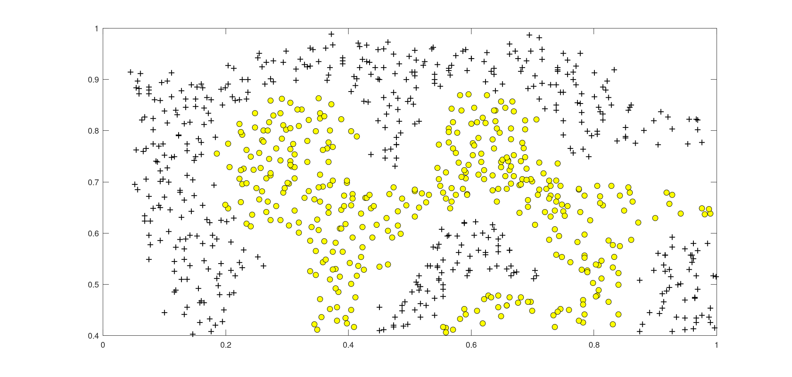
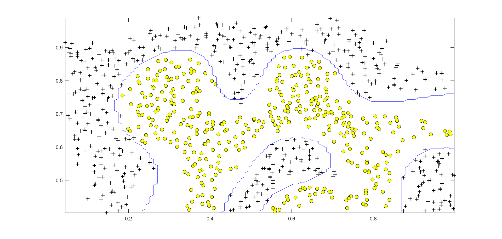
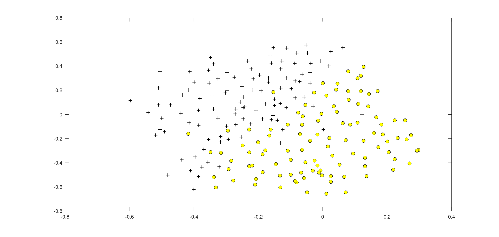
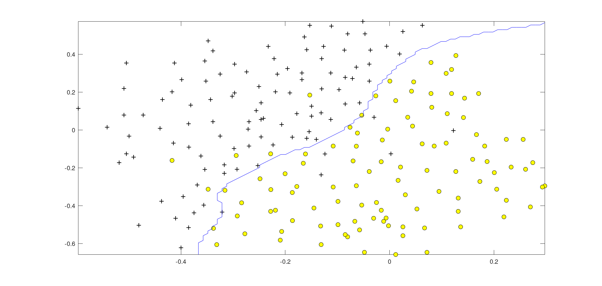

# Programming Assignment: Support Vector Machines

## ex6

Loading and Visualizing Data ...  
Program paused. Press enter to continue.    

Training ......................................................................  
....................................................................... Done!  

Program paused. Press enter to continue.  

Evaluating the Gaussian Kernel ...  
Gaussian Kernel between x1 = [1; 2; 1], x2 = [0; 4; -1], sigma = 2.000000 :  
        0.324652  
(for sigma = 2, this value should be about 0.324652)  
Program paused. Press enter to continue.  

 ሀLoading and Visualizing Data ...  
Program paused. Press enter to continue.  

Training SVM with RBF Kernel (this may take 1 to 2 minutes) ...  

Training ......................................................................  
...............................................................................  
...............................................................................  
...............................................................................  
...............................................................................  
...............................................................................  
.......................................... Done!  

Program paused. Press enter to continue.  

Loading and Visualizing Data ...  
Program paused. Press enter to continue.   

Training .......................... Done!  

Training .......................................... Done!  

Training ................................................ Done!  

Training ...................................................... Done!  

Training ................................................... Done!  

Training ................................................... Done!  

Training ........................................... Done!  

Training .......................................... Done!  

Training ....................................... Done!  

Training ................................................................ Done!  

Training ................................................... Done!  

Training ..................................................... Done!  

Training ......................... Done!  

Training ........................................... Done!  

Training ........................................................ Done!  

Training ......................................... Done!  

Training .................................... Done!  

Training ........................................................... Done!    

Training ......................................................................  
.................................................... Done!  

Training ......................................................................  
............ Done!  

Training .................................... Done!

Training .............................................. Done!  

Training ................................................. Done!  

Training ..................................................... Done!  

Training .............................................. Done!  

Training ......................................................................  
........ Done!

Training ......................................................................  
...............................................................................  
..................................... Done!  

Training ......................................................................  
...................... Done!  

Training ......................................................................  
................................ Done!  

Training ............................... Done!  

Training ............................................ Done!  

Training ........................................................... Done!  

Training ............................................ Done!  

Training ......................................................................  
...................... Done!  

Training ......................................................................  
...............................................................................  
...............................................................................  
............. Done!  

Training ......................................................................  
............................................................................ Done!  

Training ......................................................................  
... Done!  

Training ......................................................................  
.................... Done!  

Training ........................................................... Done!  

Training ..................................................... Done!  

Training .................................................. Done!  

Training ......................................................................  
. Done!  

Training ......................................................................  
...............................................................................  
...............................................................................  
...............................................................................  
...............................................................................  
...............................................................................  
........................................................................... Done!  

Training ......................................................................  
......................................................... Done!  

Training ..................................................................... Done!  

Training .................................................................. Done!  

Training .................................... Done!  

Training ................................ Done!  

Training ............................... Done!  

Training ............................................................... Done!  

Training ......................................................................  
...............................................................................  
...............................................................................  
...............................................................................  
...............................................................................  
...............................................................................  
...............................................................................  
...............................................................................  
...............................................................................  
...............................................................................  
...............................................................................  
...............................................................................  
...............................................................................  
...............................................................................  
...............................................................................  
...............................................................................  
................................................ Done!  

Training ......................................................................  
...............................................................................  
...............................................................................  
...............................................................................  
..................................................... Done!  

Training ......................................................................  
...............................................................................  
.............................. Done!      

Training ..................................................................... Done!    

Training ..................................................... Done!    

Training .......................................... Done!    

Training ..................................... Done!    

Training ..................................................... Done!  

Training ......................................................................  
...............................................................................  
...............................................................................  
...............................................................................  
...............................................................................  
...............................................................................  
...............................................................................  
...............................................................................  
...............................................................................  
...............................................................................  
...............................................................................  
...............................................................................  
............................................................... Done!  

Training ......................................................................  
...............................................................................  
...............................................................................  
...............................................................................  
............................................................................. Done!  

Training ......................................................................  
...............................................................................  
.............. Done!  

Training ......................................................................  
..................................... Done!  

Training ................................................................... Done!  

Training ...................................... Done!  

Training ......................................................................  
...............................................................................  
...............................................................................  
........................................................... Done!  

Program paused. Press enter to continue.  

## ex6_spam

Preprocessing sample email (emailSample1.txt)  

\=\=\=\= Processed Email \=\=\=\=    

anyon know how much it cost to host a web portal well it depend on how mani  
visitor you re expect thi can be anywher from less than number buck a month  
to a coupl of dollarnumb you should checkout httpaddr or perhap amazon ecnumb  
if your run someth big to unsubscrib yourself from thi mail list send an  
email to emailaddr  

\=\=\=\=\=\=\=\=\=\=\=\=\=\=\=\=\=\=\=\=\=\=\===  
Word Indices:  
 86 916 794 1077 883 370 1699 790 1822 1831 883 431 1171 794 1002 1893 1364 592 1676 238 162 89     688 945 1663 1120 1062 1699 375 1162 479 1893 1510 79  
9 1182 1237 810 1895 1440 1547 181 1699 1758 1896 688 1676 992 961 1477 71 530 1699 531  

Program paused. Press enter to continue.  

Extracting features from sample email (emailSample1.txt)  

\=\=\== Processed Email \=\=\==  

anyon know how much it cost to host a web portal well it depend on how mani  
visitor you re expect thi can be anywher from less than number buck a month  
to a coupl of dollarnumb you should checkout httpaddr or perhap amazon ecnumb  
if your run someth big to unsubscrib yourself from thi mail list send an  
email to emailaddr  

\=\=\=\=\=\=\=\=\=\=\=\=\=\=\=\=\=\=\=\=\=\=\=\==  
Length of feature vector: 1899  
Number of non-zero entries: 45  
Program paused. Press enter to continue.  

Training Linear SVM (Spam Classification)  
(this may take 1 to 2 minutes) ...  

Training ......................................................................  
...............................................................................  
.......................................................................... Done!  

Training Accuracy: 99.825000  

Evaluating the trained Linear SVM on a test set ...  
Test Accuracy: 98.700000  

Top predictors of spam:  
 our             (0.502489)  
 click           (0.469623)  
 remov           (0.420683)  
 guarante        (0.382854)  
 visit           (0.374153)  
 basenumb        (0.344395)  
 dollar          (0.323724)  
 will            (0.266732)  
 price           (0.264403)  
 nbsp            (0.259831)  
 most            (0.257038)  
 pleas           (0.256332)  
 lo              (0.254929)  
 ga              (0.245525)  
 da              (0.238294)    

Program paused. Press enter to continue.  

\=\=== Processed Email ====  

do you want to make dollarnumb or more per week if you ar a motiv and qualifi  
individu i will person demonstr to you a system that will make you dollarnumb  
number per week or more thi is not mlm call our number hour pre record number  
to get the detail number number number i need peopl who want to make seriou  
monei make the call and get the fact invest number minut in yourself now  
number number number look forward to your call and i will introduc you to  
peopl like yourself who ar current make dollarnumb number plu per week number  
number number numberljgvnumb numberleannumberlrmsnumb  
numberwxhonumberqiytnumb numberrjuvnumberhqcfnumb numbereidbnumberdmtvlnumb  

\=\==\==\==\==\==\==\==\==\==\==\====  

Processed spamSample1.txt  

Spam Classification: 1  
(1 indicates spam, 0 indicates not spam)  

## submit result

==                                   Part Name |     Score | Feedback  
==                                   --------- |     ----- | --------  
==                             Gaussian Kernel |  25 /  25 | Nice work!  
==         Parameters (C, sigma) for Dataset 3 |  25 /  25 | Nice work!  
==                         Email Preprocessing |  25 /  25 | Nice work!  
==                    Email Feature Extraction |  25 /  25 | Nice work!  
==                                   --------------------------------  
==                                             | 100 / 100 |  

