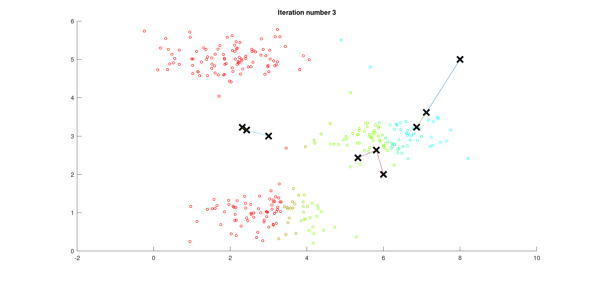
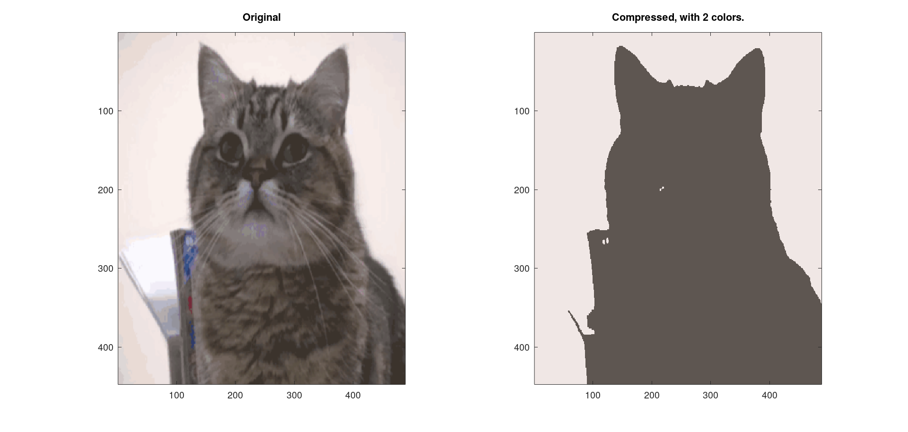

# Programming Assignment: K-Means Clustering and PCA

## ex7

 Finding closest centroids.    

Closest centroids for the first 3 examples:    
 1 3 2    
(the closest centroids should be 1, 3, 2 respectively)    
Program paused. Press enter to continue.    


Computing centroids means.    

Centroids computed after initial finding of closest centroids:    
 2.428301 3.157924    
 5.813503 2.633656    
 7.119387 3.616684      

(the centroids should be    
   [ 2.428301 3.157924 ]    
   [ 5.813503 2.633656 ]    
   [ 7.119387 3.616684 ]      

Program paused. Press enter to continue.    


Running K-Means clustering on example dataset.    

K-Means iteration 1/10...    
Press enter to continue.    


K-Means iteration 2/10...    
Press enter to continue.    


K-Means iteration 3/10...    
Press enter to continue.    



K-Means iteration 4/10...    
Press enter to continue.    


K-Means iteration 5/10...    
Press enter to continue.    


K-Means iteration 6/10...    
Press enter to continue.    


K-Means iteration 7/10...    
Press enter to continue.    


K-Means iteration 8/10...    
Press enter to continue.    


K-Means iteration 9/10...    
Press enter to continue.    


K-Means iteration 10/10...    
Press enter to continue.    


K-Means Done.    

Program paused. Press enter to continue.    


Running K-Means clustering on pixels from an image.    

K-Means iteration 1/10...    
K-Means iteration 2/10...    
K-Means iteration 3/10...        
K-Means iteration 4/10...    
K-Means iteration 5/10...    
K-Means iteration 6/10...    
K-Means iteration 7/10...        
K-Means iteration 8/10...    
K-Means iteration 9/10...    
K-Means iteration 10/10...    
Program paused. Press enter to continue.    

Applying K-Means to compress an image.    

Program paused. Press enter to continue.    


## ex7_pca

Visualizing example dataset for PCA.    

Program paused. Press enter to continue.    


Running PCA on example dataset.    

Top eigenvector:    
 U(:,1) = -0.707107 -0.707107    

(you should expect to see -0.707107 -0.707107)    
Program paused. Press enter to continue.    


 Dimension reduction on example dataset.    

Projection of the first example: 1.481274    

(this value should be about 1.481274)    

Approximation of the first example: -1.047419 -1.047419    

(this value should be about  -1.047419 -1.047419)    

Program paused. Press enter to continue.    


Loading face dataset.    

Program paused. Press enter to continue.    


Running PCA on face dataset.    
(this might take a minute or two ...)    

Program paused. Press enter to continue.    


Dimension reduction for face dataset.    

The projected data Z has a size of: 5000 100    

Program paused. Press enter to continue.    


Visualizing the projected (reduced dimension) faces.    

Program paused. Press enter to continue.    


K-Means iteration 1/10...    
K-Means iteration 2/10...    
K-Means iteration 3/10...    
K-Means iteration 4/10...    
K-Means iteration 5/10...    
K-Means iteration 6/10...        
K-Means iteration 7/10...    
K-Means iteration 8/10...    
K-Means iteration 9/10...        
K-Means iteration 10/10...    
Program paused. Press enter to continue.    


Program paused. Press enter to continue.    


## submit result

==                                   Part Name |     Score | Feedback    
==                                   --------- |     ----- | --------   
==            Find Closest Centroids (k-Means) |  30 /  30 | Nice work!   
==            Compute Centroid Means (k-Means) |  30 /  30 | Nice work!   
==                                         PCA |  20 /  20 | Nice work!   
==                          Project Data (PCA) |  10 /  10 | Nice work!   
==                          Recover Data (PCA) |  10 /  10 | Nice work!   
==                                   --------------------------------   
==                                             | 100 / 100 |   

## Optional (ungraded) exercise

### Use your own image

```octave
%% ============= Part 4: K-Means Clustering on Pixels ===============
%  In this exercise, you will use K-Means to compress an image. To do this,
%  you will first run K-Means on the colors of the pixels in the image and
%  then you will map each pixel onto its closest centroid.
%  
%  You should now complete the code in kMeansInitCentroids.m
%

fprintf('\nRunning K-Means clustering on pixels from an image.\n\n');

%  Load an image of a bird
A = double(imread('cat.png'));

% If imread does not work for you, you can try instead
%   load ('bird_small.mat');

A = A / 255; % Divide by 255 so that all values are in the range 0 - 1

% Size of the image
img_size = size(A);

% Reshape the image into an Nx3 matrix where N = number of pixels.
% Each row will contain the Red, Green and Blue pixel values
% This gives us our dataset matrix X that we will use K-Means on.
X = reshape(A, img_size(1) * img_size(2), 3);

% Run your K-Means algorithm on this data
% You should try different values of K and max_iters here
K = 16;
max_iters = 10;

% When using K-Means, it is important the initialize the centroids
% randomly. 
% You should complete the code in kMeansInitCentroids.m before proceeding
initial_centroids = kMeansInitCentroids(X, K);

% Run K-Means
[centroids, idx] = runkMeans(X, initial_centroids, max_iters);

fprintf('Program paused. Press enter to continue.\n');
pause;
```

K = 16   


K = 8


K = 4


K = 2



K = 1


### PCA for visualization

The result is shown in the end of ex7_pca.  
