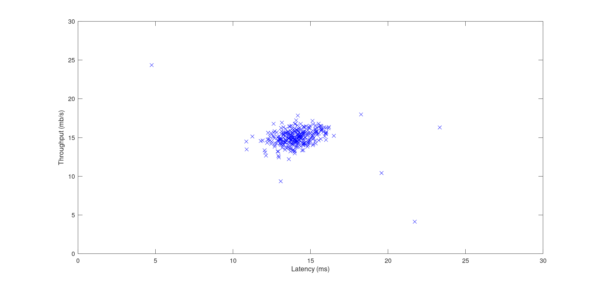
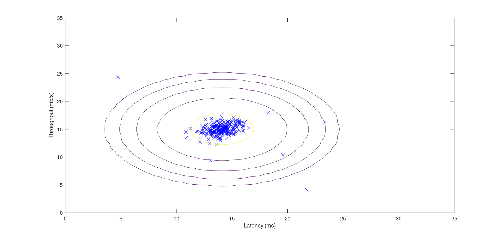
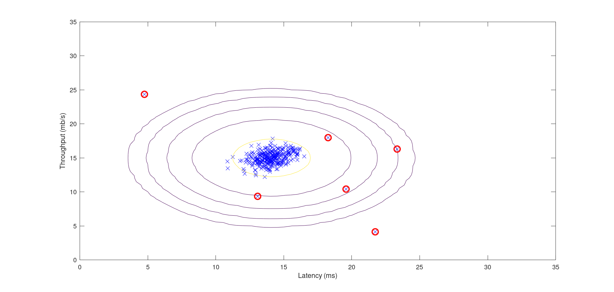
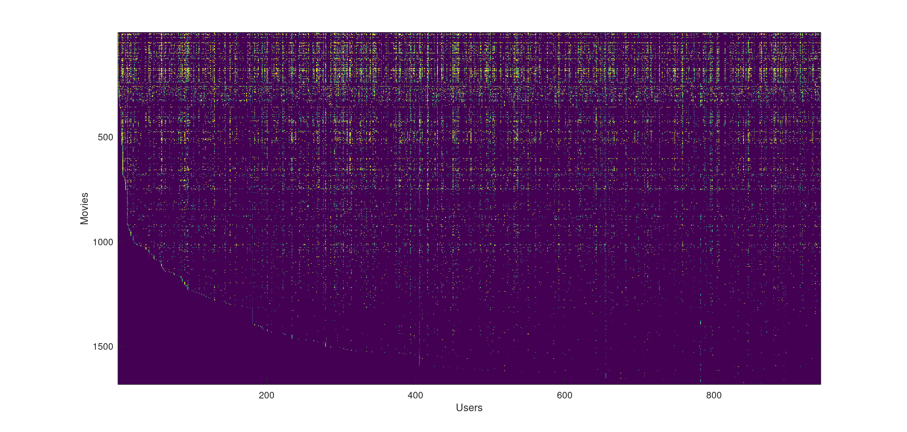

# Programming Assignment: Anomaly Detection and Recommender Systems

## ex8

Visualizing example dataset for outlier detection.   

Program paused. Press enter to continue.  

Visualizing Gaussian fit.  

Program paused. Press enter to continue.  

Best epsilon found using cross-validation: 8.990853e-05  
Best F1 on Cross Validation Set:  0.875000  
   (you should see a value epsilon of about 8.99e-05)  
   (you should see a Best F1 value of  0.875000)  

Program paused. Press enter to continue.  

Best epsilon found using cross-validation: 1.377229e-18  
Best F1 on Cross Validation Set:  0.615385  
   (you should see a value epsilon of about 1.38e-18)  
   (you should see a Best F1 value of 0.615385)  

\# Outliers found: 117

## ex8_cofi

Loading movie ratings dataset.  

Average rating for movie 1 (Toy Story): 3.878319 / 5  

Program paused. Press enter to continue.  

Cost at loaded parameters: 22.224604  
(this value should be about 22.22)  

Program paused. Press enter to continue.  

Checking Gradients (without regularization) ...  
   -0.8236   -0.8236  
    4.1975    4.1975  
   -0.2630   -0.2630  
    4.4129    4.4129  
   -4.2012   -4.2012  
   -7.7260   -7.7260  
   -3.5839   -3.5839  
  -22.2411  -22.2411  
    1.5012    1.5012  
   -6.1319   -6.1319  
    0.6647    0.6647  
  -14.1196  -14.1196  
    3.5462    3.5462  
    3.9124    3.9124  
   -2.6535   -2.6535  
    1.6408    1.6408  
    1.9981    1.9981    
    9.9643    9.9643  
    7.5507    7.5507  
    1.7637    1.7637  
    9.5969    9.5969  
    2.9427    2.9427  
    8.1147    8.1147  
    3.9087    3.9087  
   -1.2759   -1.2759  
    2.9873    2.9873  
    1.6357    1.6357  
The above two columns you get should be very similar.  
(Left-Your Numerical Gradient, Right-Analytical Gradient)  

If your cost function implementation is correct, then  
the relative difference will be small (less than 1e-9).  

Relative Difference: 1.32188e-12  

Program paused. Press enter to continue.  

Cost at loaded parameters (lambda = 1.5): 31.344056  
(this value should be about 31.34)  

Program paused. Press enter to continue.  

Checking Gradients (with regularization) ...  
  -2.8218  -2.8218  
   3.1415   3.1415  
  -1.3292  -1.3292  
   0.2925   0.2925  
   2.6080   2.6080  
  -2.3458  -2.3458  
  -1.4376  -1.4376  
   2.4503   2.4503  
   4.5024   4.5024  
  -5.2465  -5.2465  
  -1.1057  -1.1057  
   6.1252   6.1252  
  -3.8627  -3.8627  
   0.4084   0.4084  
  -0.9099  -0.9099  
   0.9860   0.9860  
  -0.1545  -0.1545  
   1.0161   1.0161  
   1.4074   1.4074  
  -1.0107  -1.0107  
  -0.6833  -0.6833  
  -0.7877  -0.7877  
   5.8184   5.8184  
   1.9127   1.9127  
  -5.6702  -5.6702  
  -1.3936  -1.3936  
  -9.0277  -9.0277  
The above two columns you get should be very similar.  
(Left-Your Numerical Gradient, Right-Analytical Gradient)  

If your cost function implementation is correct, then  
the relative difference will be small (less than 1e-9).    

Relative Difference: 1.49855e-12  

Program paused. Press enter to continue.  

New user ratings:  
Rated 4 for Toy Story (1995)  
Rated 3 for Twelve Monkeys (1995)  
Rated 5 for Usual Suspects, The (1995)  
Rated 4 for Outbreak (1995)  
Rated 5 for Shawshank Redemption, The (1994)  
Rated 3 for While You Were Sleeping (1995)  
Rated 5 for Forrest Gump (1994)  
Rated 2 for Silence of the Lambs, The (1991)  
Rated 4 for Alien (1979)  
Rated 5 for Die Hard 2 (1990)  
Rated 5 for Sphere (1998)  

Program paused. Press enter to continue.  

Training collaborative filtering...  
Iteration   100 | Cost: 3.896086e+04  
Recommender system learning completed.  

Program paused. Press enter to continue.  

Top recommendations for you:  
Predicting rating 5.0 for movie Someone Else's America (1995)  
Predicting rating 5.0 for movie Prefontaine (1997)  
Predicting rating 5.0 for movie Star Kid (1997)  
Predicting rating 5.0 for movie They Made Me a Criminal (1939)  
Predicting rating 5.0 for movie Great Day in Harlem, A (1994)  
Predicting rating 5.0 for movie Aiqing wansui (1994)  
Predicting rating 5.0 for movie Entertaining Angels: The Dorothy Day Story (1996)  
Predicting rating 5.0 for movie Saint of Fort Washington, The (1993)  
Predicting rating 5.0 for movie Marlene Dietrich: Shadow and Light (1996)  
Predicting rating 5.0 for movie Santa with Muscles (1996)  

Original ratings provided:  
Rated 4 for Toy Story (1995)  
Rated 3 for Twelve Monkeys (1995)  
Rated 5 for Usual Suspects, The (1995)  Rated 4 for Outbreak (1995)  
Rated 5 for Shawshank Redemption, The (1994)  
Rated 3 for While You Were Sleeping (1995)  
Rated 5 for Forrest Gump (1994)  
Rated 2 for Silence of the Lambs, The (1991)  
Rated 4 for Alien (1979)  
Rated 5 for Die Hard 2 (1990)  
Rated 5 for Sphere (1998)  

## submit_result

==                                   Part Name |     Score | Feedback   
==                                   --------- |     ----- | --------  
==                Estimate Gaussian Parameters |  15 /  15 | Nice work!  
==                            Select Threshold |  15 /  15 | Nice work!  
==                Collaborative Filtering Cost |  20 /  20 | Nice work!  
==            Collaborative Filtering Gradient |  30 /  30 | Nice work!  
==                            Regularized Cost |  10 /  10 | Nice work!  
==                        Regularized Gradient |  10 /  10 | Nice work!  
==                                   --------------------------------  
==                                             | 100 / 100 |  
